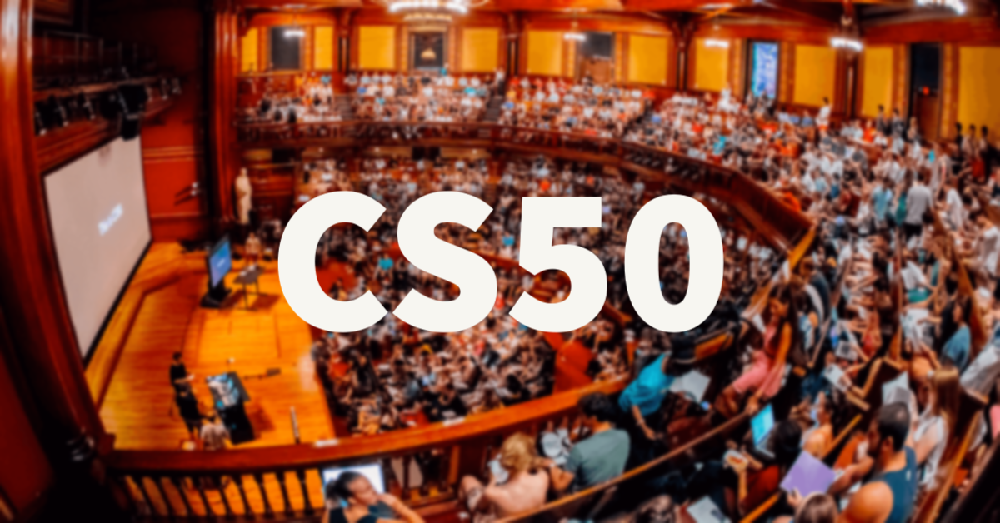

<h1 align="center">Hi, I'm Ahmed M. Yahia </h1>
<h4 align="center"> Software Engineer and Teaching Assistant at AIU </h4>

<h1 align="center">🗺 Computer Science Fundemantals Roadmap</h1>

<h4 align="center">This roadmap provides a structured guide for beginners to explore the fundamentals of computer science. The resources included are personal recommendations. Feel free to choose your own path as you learn and grow!</h4>

  

 

## Content

[**Introduction to Computer Science**](#1-introduction-to-computer-science)

[**Programming Paradigms (Especially OOP)**](#2-programming-paradigms-especially-oop)

[**Data Structures and Algorithms**](#3-data-structures-and-algorithms)

[**Databases**](#4-databases)

[**Operating Systems (OS)**](#5-operating-systems-os)

[**Problem Solving**](#6-problem-solving)

[**Version Control**](#7-version-control)

 

---

 

# Introduction to Computer Science

> **Note:** Choose the course that best aligns with your interests and learning style. Each of these courses will provide you with a solid foundation in computer science.
---

## 1. CS50: Introduction to Computer Science (Preferred)
This is Harvard University's introduction to the intellectual enterprises of computer science and the art of programming. The course teaches students how to think algorithmically and solve problems efficiently. Topics include abstraction, algorithms, data structures, encapsulation, resource management, security, software engineering, and web development. Languages include C, Python, and SQL plus HTML, CSS, and JavaScript.

- [CS50: Introduction to Computer Science](https://www.edx.org/learn/computer-science/harvard-university-cs50-s-introduction-to-computer-science)
- [CS50 In Arabic](https://www.youtube.com/playlist?list=PLknwEmKsW8OvMsFbU9zo8oJCprAsgc4LO)

  

  

---

## 2. Introduction to Computer Science and Programming Using Python
This is an introductory course in computer science that uses Python as the primary language. The course covers basic concepts such as algorithms, data structures, and computational thinking. It's a great starting point for anyone new to programming and computer science.

[Introduction to Computer Science and Programming Using Python](https://www.edx.org/learn/computer-science/massachusetts-institute-of-technology-introduction-to-computer-science-and-programming-using-python)

  

  

---
# Next Step: Choose a Programming Language

#### After completing the Introduction to Computer Science, it's time to dive deeper into a specific programming language. Below are resources for both Java and C++. Choose only **one** to focus on—the main difference between these languages is their syntax, so the concepts you learn will be applicable in either case.

---

## ☕ Java

- **English**
    - [Java Tutorial for Beginners - Crash Course](https://youtu.be/eIrMbAQSU34?si=0fuf36q7lrjGieo8)
    - [Java Programming for Beginners - FreeCodeCamp Crash Course](https://youtu.be/A74TOX803D0?si=1rQQWSE_7VreRVtw)

- **Arabic**
   - [Learn JAVA Programming From Scratch In Arabic - Adel Nasim](https://youtube.com/playlist?list=PLCInYL3l2AajYlZGzU_LVrHdoouf8W6ZN&si=86pJLYf_qGPv2gyE)
   - [Java Programming For Beginners - Course 1- بالعربى - Dr.Mohamed El Desouky](https://youtube.com/playlist?list=PL1DUmTEdeA6K7rdxKiWJq6JIxTvHalY8f&si=wBnqFpgvpg9MrdCr)
   - [Java - بالعربي](https://youtu.be/is37On2-xgQ?si=MYUYKVn8qIjO-9z0)
     
- **Tutorials**
   - [Java Documentation - Oracle](https://docs.oracle.com/en/java/)
   - [Java Tutorial - W3Schools](https://www.w3schools.com/java)
   - [Java Tutorial - Javatpoint](https://www.javatpoint.com/java-tutorial)
   - [Java Tutorial - Tutorialspoint](https://www.tutorialspoint.com/java)
   - [Java Tutorial - Tutorialspoint](https://www.tutorialspoint.com/java)
   - [Java Tutorial - GeeksforGeeks](https://www.geeksforgeeks.org/java/)

---

## 🖥️ C++

- **English**
  - [C++ Tutorial for Beginners - FreeCodeCamp Crash Course](https://youtu.be/vLnPwxZdW4Y?si=do7-JVxyq7LBUqVG)
  - [C++ Programming Course - Beginner to Advanced - FreeCodeCamp](https://youtu.be/8jLOx1hD3_o?si=8xnUkbi8XO-mvlq0)

- **Arabic**
  - [CPP for beginners - سي بلس للمبتدئين - Dr Mustafa Saad](https://youtube.com/playlist?list=PLPt2dINI2MIbwnEoeHZnUHeUHjTd8x4F3&si=iwgxMvbTw4lauDfb)
  - [Fundamentals Of Programming With C++ - Elzero Web School](https://youtube.com/playlist?list=PLDoPjvoNmBAwy-rS6WKudwVeb_x63EzgS&si=Pw-zeMW-cssGLEkL)
  - [Learn C++ Programming From Scratch In Arabic - Adel Nasim](https://youtube.com/playlist?list=PLCInYL3l2AajFAiw4s1U4QbGszcQ-rAb3&si=16vIfd0OwKqpUTLe)
  - [programming 1 - Programming For Beginners - C++ عربى - Dr.Mohamed El Desouky](https://youtube.com/playlist?list=PL1DUmTEdeA6IUD9Gt5rZlQfbZyAWXd-oD&si=gJ-SAIWXU60ljRbC)

---

> **Note:** The core programming concepts you'll learn in Java, C++ and most of programming languages are fundamentally the same. The choice of language primarily affects the syntax you'll use to implement these concepts. Pick the language that aligns best with your interests or future goals.
# Object Oriented Programming (OOP).

### Learn the various programming paradigms, with a strong focus on Object-Oriented Programming (OOP).

## ☕ Object Oriented Programming in Java

- **English**
    - [Full Java Course by Alex Lee - From video 71](https://www.youtube.com/playlist?list=PL59LTecnGM1NRUyune3SxzZlYpZezK-oQ)

- **Arabic**
   - [Object-Oriented Programming JAVA in Arabic - Adel Nasim](https://youtube.com/playlist?list=PLCInYL3l2AagY7fFlhCrjpLiIFybW3yQv&si=ffwN6Pv4c7bk9RBC)
   - [Programming 2 - Object Oriented Programming With Java](https://youtu.be/M3Na5luSx50?si=8JPS6nFvsArADiYB)
   - [OOP - بالعربي](https://youtube.com/playlist?list=PLwWuxCLlF_ue7GPvoG_Ko1x43tZw5cz9v&si=FD1ZbGIa64hf6nBw)

---

## 🖥️ Object Oriented Programming C++

- **English**
  - [Object Oriented Programming (OOP) in C++ Course - FreeCodeCamp Crash Course](https://youtu.be/wN0x9eZLix4?si=nJYhSnegkQLfl9r0)

- **Arabic**
  - [C++ Object-Oriented Design and Programming - Dr Mustafa Saad](https://youtube.com/playlist?list=PLPt2dINI2MIbMba7tpx3qvmgOsDlpITwG&si=JhCD8nN7pDcn5s-G)
  - [Object-Oriented Programming C++ in Arabic - Adel Nasim](https://youtube.com/playlist?list=PLCInYL3l2Aaiq1oLvi9TlWtArJyAuCVow&si=b8zjSYQd7HoeMT0N)
  - [Programming 2 - Object Oriented Programming with C++ - Dr.Mohamed El Desouky](https://youtube.com/playlist?list=PL1DUmTEdeA6KLEvIO0NyrkT91BVle8BOU&si=1d91-1biDzNIkQUl)

---

 

# Contact Me 📱

